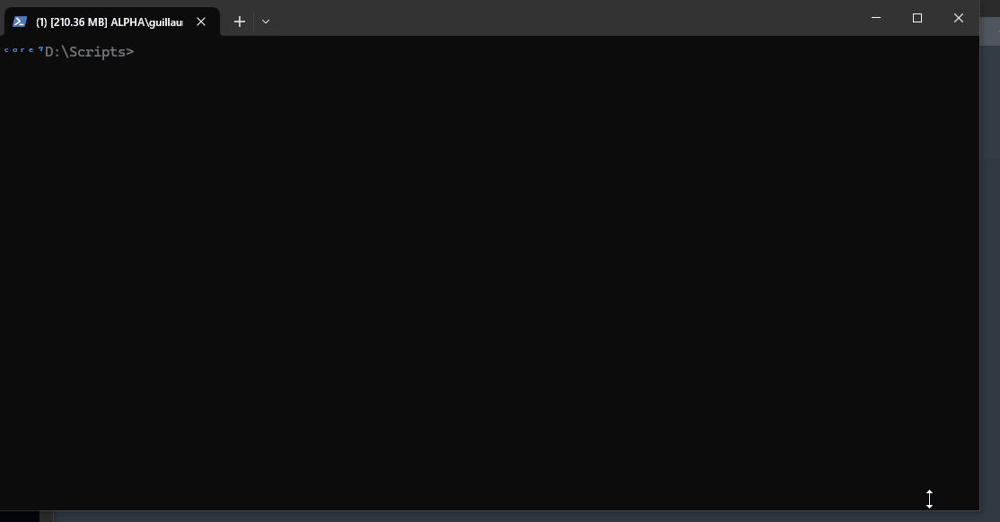
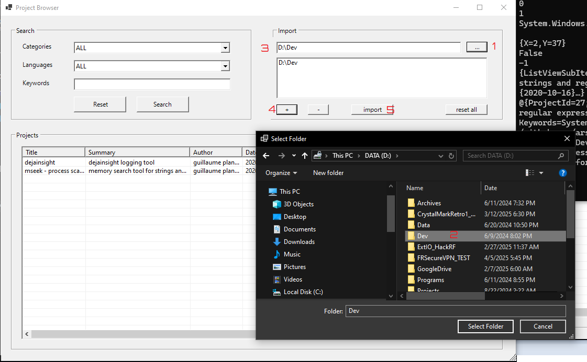

<p align="center">
  
</p>

This Tool is Database driven program to list and search projects based on languages, categories, keywords, etc...

## Before Starting...

1. Clone [https://github.com/arsscriptum/PowerShell.ProjectIndexer](https://github.com/arsscriptum/PowerShell.ProjectIndexer): ```git clone https://github.com/arsscriptum/PowerShell.ProjectIndexer.git```

## How does it work ?


1. Create a ```project.nfo``` file and add it to your project <sup>[1](#ref1)</sup>
2. Load the GUI Project Indexer  <sup>[2](#ref2)</sup> :

```powershell
> git clone https://github.com/arsscriptum/PowerShell.ProjectIndexer.git ProjectIndexer
> cd .\ProjectIndexer
> . .\scripts\ShowProjects.ps1
```
3. Import projects data files from folders  <sup>[3](#ref3)</sup> 


------------------------------

<a id="ref1"></a> Create a ```project.nfo``` file

```powershell
New-ProjectDataFile `
    -Title "mseek - process scanner" `
    -Summary "memory search tool for strings and regular expressions" `
    -Author "guillaume plante" `
    -Category "general" `
    -Date (Get-Date '2020-10-16') `
    -Languages @("c++", "powershell") `
    -Keywords @("memory", "scan") `
    -Permalink "https://github.com/arsscriptum/mseek" `
    -Thumbnail "https://github.com/arsscriptum/mseek/raw/refs/heads/mseek_stable/img/banner_s.png" 
```

Outputs:

```powershell

{
  "Title": "mseek - process scanner",
  "Summary": "memory search tool for strings and regular expressions",
  "Author": "guillaume plante",
  "Date": "2020-10-16T00:00:00",
  "Category": "general",
  "Languages": [
    "c++",
    "powershell"
  ],
  "Keywords": [
    "memory",
    "scan"
  ],
  "Permalink": "https://github.com/arsscriptum/mseek",
  "Thumbnail": "https://github.com/arsscriptum/mseek/raw/refs/heads/mseek_stable/img/banner_s.png"
}


```

so

```powershell
New-ProjectDataFile `
    -Title "mseek - process scanner" `
    -Summary "memory search tool for strings and regular expressions" `
    -Author "guillaume plante" `
    -Category "general" `
    -Date (Get-Date '2020-10-16') `
    -Languages @("c++", "powershell") `
    -Keywords @("memory", "scan") `
    -Permalink "https://github.com/arsscriptum/mseek" `
    -Thumbnail "https://github.com/arsscriptum/mseek/raw/refs/heads/mseek_stable/img/banner_s.png" | Set-Content "project.nfo"
```


<a id="ref2"></a>[2] 




<a id="ref3"></a>[3] 



